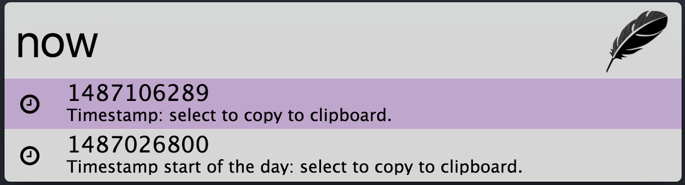
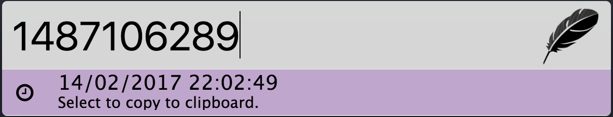
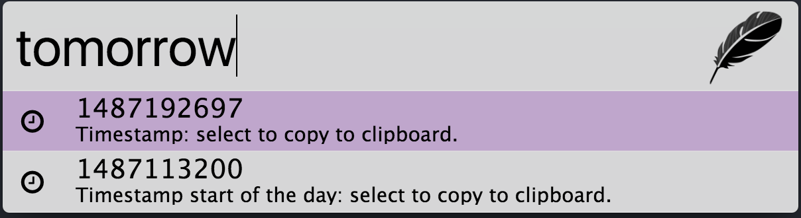
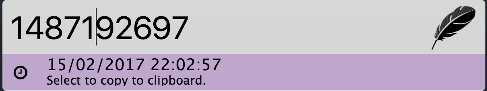
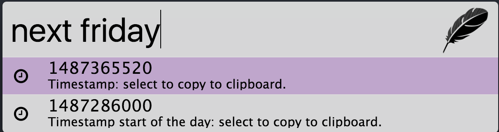
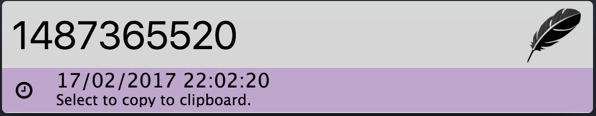

## Zazu-utime

Plugin for [Zazu](http://zazuapp.org/) inspired by this [Chrome extension](https://chrome.google.com/webstore/detail/kpcibgnngaaabebmcabmkocdokepdaki).

## Keywords
See [date-util](https://www.npmjs.com/package/date-util) for examples.

Added a few custom missing keywords in date-util:
- today
- now
- tomorrow
- yesterday

## Installing

Add `puyt/zazu-utime` inside of `plugins` block of your  `~/.zazurc.json` file.

~~~ json
{
  "plugins": [
      "puyt/zazu-utime"
  ]
}
~~~

### Variables
- `timestampUnit`: seconds or milliseconds
- `outputFormat`: see npm package [date-util](https://www.npmjs.com/package/date-util#date-format)

~~~ json
{
  "plugins": [
    {
        "name": "puyt/zazu-utime",
        "variables": {
            "timestampUnit": "milliseconds",
            "timestampUnit": "yyy/mm/dd HH:MM:ss"
        }
    }
  ]
}
~~~

## Screenshots

## Uses
- [date-util](https://www.npmjs.com/package/date-util)
